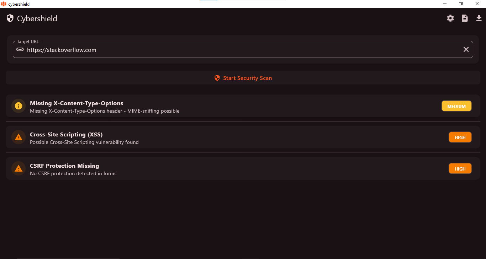
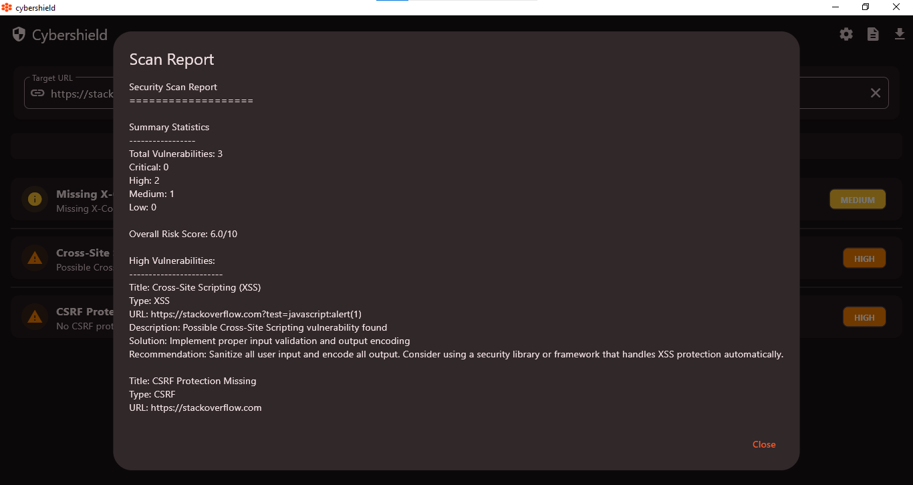
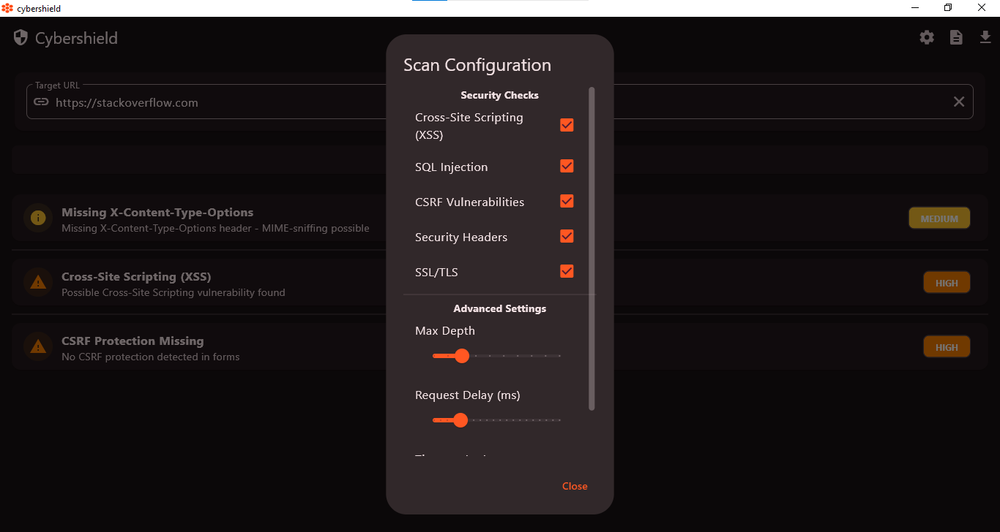

# CyberShield - Website Vulnerability Scanner

CyberShield is a desktop application designed to scan websites for potential security vulnerabilities. It helps developers, security professionals, and website administrators quickly identify and fix issues that could leave their websites open to attacks. The app provides reports in multiple formats such as TXT, PDF, CSV, JSON, and HTML to ensure flexibility in vulnerability tracking and documentation.

## Features

- **Website Scanning**: Scans websites for common security vulnerabilities such as SQL Injection, Cross-Site Scripting (XSS), Cross-Site Request Forgery (CSRF), etc.
- **Detailed Reports**: Generates vulnerability reports in multiple formats including TXT, PDF, CSV, JSON, and HTML.
- **User-Friendly Interface**: Intuitive and easy-to-use interface to initiate scans and view results.
- **Cross-Platform Support**: Available for macOS, Windows, and Linux.
- **Real-Time Feedback**: Displays vulnerabilities in real time during the scanning process.
- **Customizable Settings**: Choose specific types of vulnerabilities to scan and configure the scanning depth.

## Installation

### Prerequisites

Before you begin, ensure that you have the following installed:

- **Windows**: Windows 10 or later
- **macOS**: macOS 10.12 or later
- **Linux**: A modern Linux distribution (Ubuntu, Fedora, etc.)
- **Flutter**: Version 2.0 or higher (for building from source)

### Steps to Install

1. **Download the latest version of CyberShield** for your platform:
   
   - [Windows Installer](link-to-windows-installer)

2. **Run the installer** for your platform and follow the on-screen instructions to complete the installation.

---

## Usage

1. **Launching CyberShield**: After installation, launch the application by double-clicking the executable file on your desktop.

2. **Scan a Website**:
   - Enter the URL of the website you wish to scan.
   - Select the types of vulnerabilities you want to check (e.g., SQL Injection, XSS).
   - Click the "Start Scan" button to begin the process.
   
3. **View Scan Results**: Once the scan is completed, the app will display a summary of detected vulnerabilities.

4. **Generate a Report**: 
   - After the scan, click on the "Export Report" button.
   - Choose the format (TXT, PDF, CSV, JSON, or HTML).
   - The report will be saved in the default directory, or you can specify a custom output path.

---

## File Formats for Export

- **TXT**: A plain text report of the scan results.
- **PDF**: A formatted report suitable for printing or sharing.
- **CSV**: A comma-separated value file for importing results into a spreadsheet.
- **JSON**: A machine-readable format for integration with other tools or databases.
- **HTML**: A web-based report format that can be viewed in any browser.

---

## Screenshots

Here are some screenshots of CyberShield in action:

- **Homepage**: 
- **Scan Results**: 
- **Scan Configuration**: 

---

## Technologies Used

- **Flutter**: Cross-platform UI framework used to build the application.
- **Dart**: Programming language used for app logic.
- **Third-Party Vulnerability Libraries**: Libraries used to detect common vulnerabilities like SQL Injection, XSS, etc.
- **Custom Report Generation**: Logic for generating reports in multiple formats (PDF, TXT, CSV, etc.).

---

## Contributing

CyberShield is an open-source project, and we welcome contributions from developers and security experts. To contribute:

1. Fork the repository.
2. Create a new branch for your feature or bug fix.
3. Make the changes and test them locally.
4. Submit a pull request with a clear description of your changes.

---

## License

This project is licensed under the MIT License - see the [LICENSE](LICENSE) file for details.

---

## Support

If you encounter any issues or have questions, please feel free to:

- Check the [FAQ](#) section.
- Open an issue on GitHub.
- Contact me via email at devathulvinod@gmail.com.

---

## Disclaimer

CyberShield is intended for ethical use only. Please ensure that you have the proper authorization before scanning any websites. Unauthorized scanning of websites without consent is illegal and can result in legal action.
